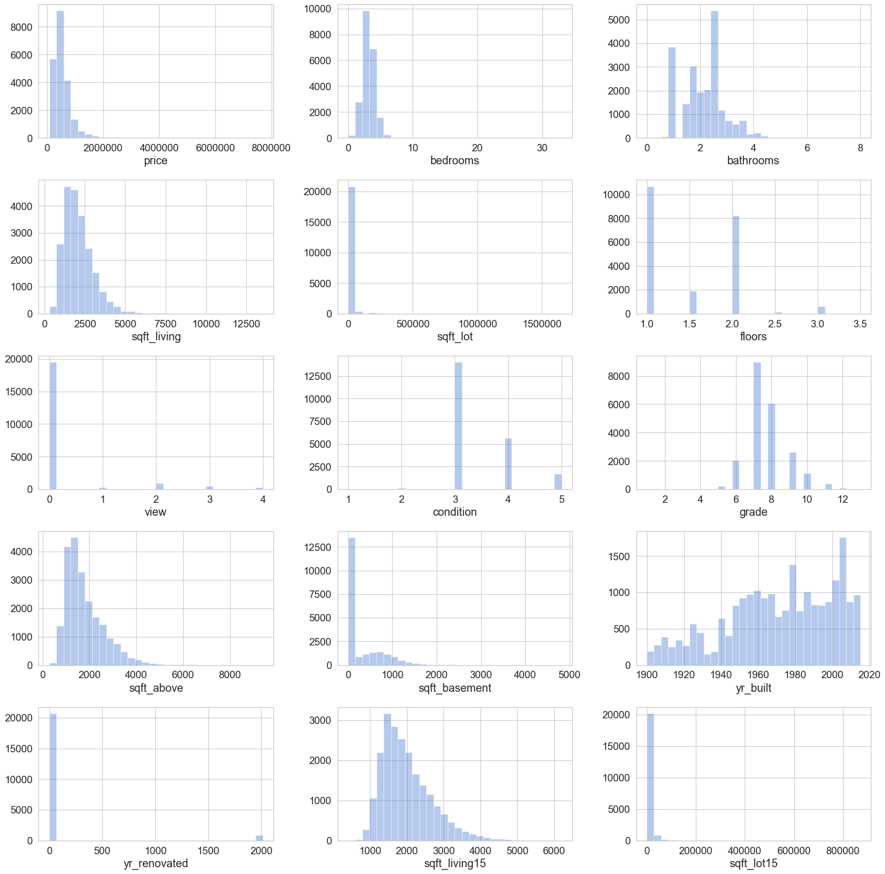
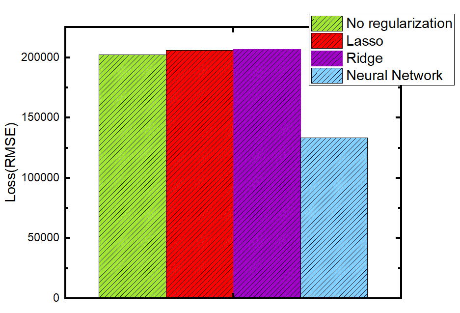
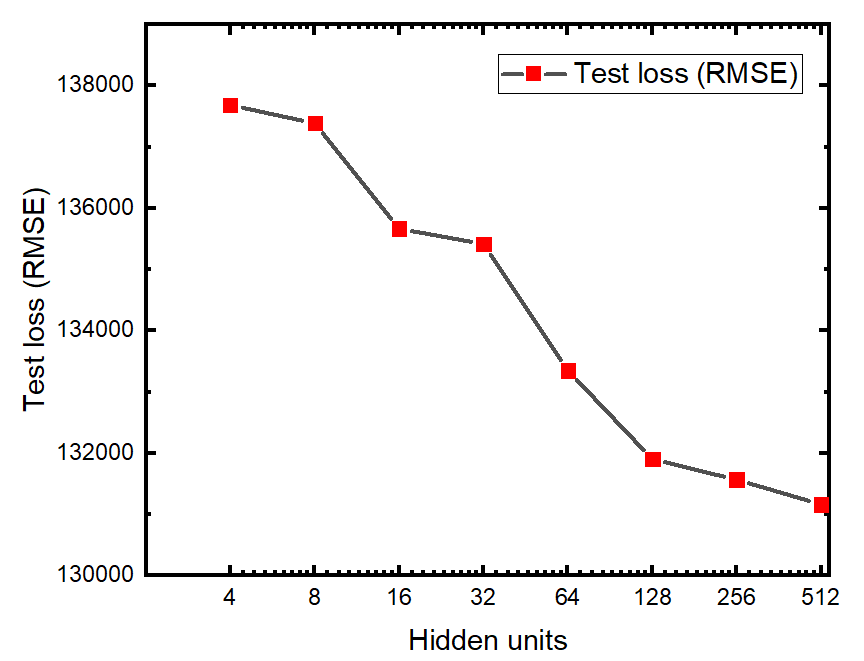
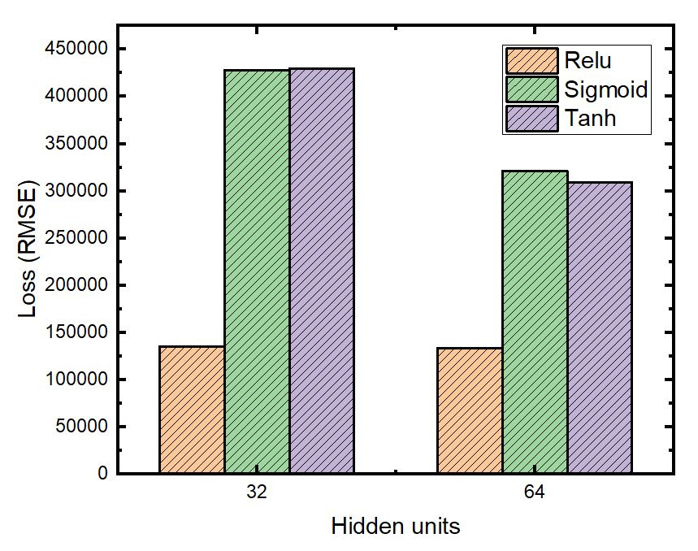
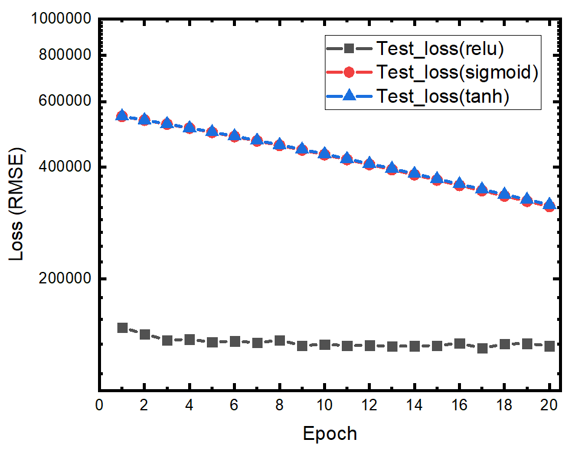
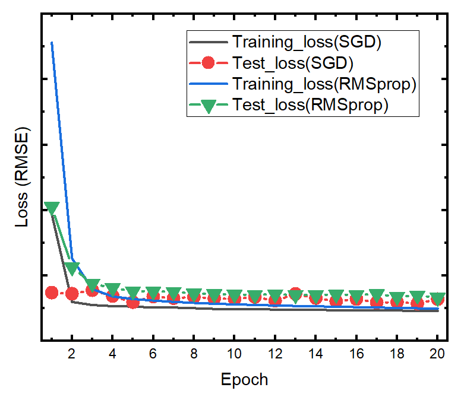

# Project title: House Price Analysis and Prediction with Machine Learning Methods
## Team members: Yandong Luo, Xiaochen Peng, Hongwu Jiang and Panni Wang

---
# 1. Motivaton
House price is highly concerned by people that are looking for places to live or opportunities to invest. Actually,  

In fact, many factors influence housing price, such as the area of the house, the number of bedrooms, the location et. al. Therefore, in this project, we will focus on the following three aspects related to house price, which is important to help us make a good deal:  
1. Find the main factors that influence house price with feature selection methods such as recursive feature selection (RFE) and RandomForest
2. Build house price prediction model using linear regression and neural network
3. House recommendation based on consumers’ preference with k-neareat neighbor method (K-NN)

---
# 2. Dataset and visulization 
## Dataset: House Sales in King County (from Kaggle)
## Features in the dataset: 21 features in total
1. id: notation for a house  
2. date: date house was sold  
3. price: the sell price of the house, which is what we need to predict
4. bedrooms: Number of Bedrooms/House
5. bathrooms: Number of bathrooms/House  
6. sqft_livingsquare footage of the home  
7. sqft_lotsquare footage of the lot  
8. floorsTotal: floors (levels) in house  
9. waterfront: House which has a view to a waterfront  
10. view: Has been viewed?  
11. condition: How good the condition is ( Overall )  
12. grade: overall grade given to the housing unit, based on King County grading system  
13. sqft_above: square footage of house apart from basement  
14. sqft_basements: quare footage of the basement  
15. yr_built: Built Year  
16. yr_renovated: Year when house was renovated  
17. zipcode: zip  
18. lat: Latitude coordinate  
19. long: Longitude coordinate  
20. sqft_living15: Living room area in 2015 This might or might not have affected the lotsize area  
21. sqft_lot15: lot size area in 2015  

## dataset visulization
15 features are visulized as below. The features as the following characteristics: 
1. The scale of each feature is quite different. It needs to be normalized
2. There are continuos variables (sqrf_lot et.al), dicreste variables (bedrooms) and categorical variable (yr_renovated)

---
# 3. Data pre-processing
After the dataset is visulized and examined, the data is processed in following ways: 
1. remove irrelevant features: id, date, lat, long, zipcode
2. remove the feature "waterfront" as it is 0 for all the data points
3. normalize the all the features with its mean and sigma as their scale is quite different
4. There is a categorical feature: yr_renovated. It is either 0 or the year that it has been renovated. It is treat as a dummy variable with only two values: "1" if the house has been renovated and "0" if it has not. 

---
# 4. Feature selection 

# 5. Housing price prediction with linear regression

# 6. Housing price prediction with neural netwok
## neural network vs linear regression
A 2-layer neural network with fully connected layer is implemented for house price prediction. The hidden layer unit is 64, the activation function at the hidden layer is ReLU and the output is the house price. The prediction is evaluated with root-mean-squred-error (RMSE) of the predicted house price. The neural network is trained with 20 epoch.  
First, the RMSE obtained by neural network method is compared with that of linear regression, as shown in the figure below. Neural network shows lower loss than all the linear regression based methods, which indicates that it can be a good model for house price prediction. 

## prediction loss vs. number of hidden units
Then we examined the prediction loss with different neural network settings. The prediction loss of the neural network can be decreased by increasing the number of hidden units, as shown in the figure below. It means that a more complicated model is desired for this task

## prediction loss vs. activation function
Three different activation functions are examined ReLU, Sigmoid and Tanh. The results shows that prediction loss is small when "ReLU" is used while the prediction loss is large when the activation is Sigmoid or Tanh. The prediction loss vs. training epoch is plotted. The neural networks with Sigmoid and Tanh shows slow training as the neuron activation value is limited, which is (0,1) for Sigmoid and (-1,1) for Tanh

## Prediction loss vs. optimizers
The prediction loss of neural network trained with different optimization method are also examined with SGD and RMSprop. RMSprop shows faster convergence and less fluctuations when it is convergent because the learning rate can be varied during the training. 

# 7. Housing recommendation with K-NN

# 8. Conclusion

# 9. Reference

