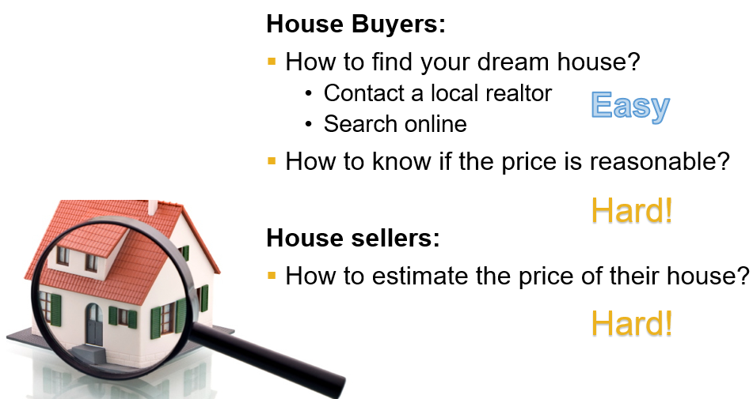

# Project title: House Price Analysis and Prediction with Machine Learning Methods
## Team members: Yandong Luo, Xiaochen Peng, Hongwu Jiang and Panni Wang

---
# 1. Motivaton
House price is highly concerned by people that are looking for places to live or opportunities to invest.  

In fact, many factors influence housing price, such as the area of the house, the number of bedrooms, the location et. al. Therefore, in this project, we will focus on the following three aspects related to house price, which is important to help us make a good deal:  
1. Find the main factors that influence house price with feature selection methods such as recursive feature selection (RFE) and RandomForest
2. Build house price prediction model using linear regression and neural network
3. House recommendation based on consumers’ preference with k-neareat neighbor method (K-NN)

---
# 2. Introduction to Dataset and visulization 
## Dataset: House Sales in King County (from Kaggle)
## Features in the dataset: 21 features in total
1. id: notation for a house  
2. dateDate: house was sold  
3. price: the sell price of the house, which is what we need to predict
4. bedrooms: Number of Bedrooms/House
5. bathrooms: Number of bathrooms/House  
6. sqft_livingsquare footage of the home  
7. sqft_lotsquare footage of the lot  
8. floorsTotal: floors (levels) in house  
9. waterfront: House which has a view to a waterfront  
10. view: Has been viewed?  
11. condition: How good the condition is ( Overall )  
12. grade: overall grade given to the housing unit, based on King County grading system  
13. sqft_above: square footage of house apart from basement  
14. sqft_basements: quare footage of the basement  
15. yr_built: Built Year  
16. yr_renovated: Year when house was renovated  
17. zipcode: zip  
18. lat: Latitude coordinate  
19. long: Longitude coordinate  
20. sqft_living15: Living room area in 2015 This might or might not have affected the lotsize area  
21. sqft_lot15: lot size area in 2015  

## dataset processing and 

# 3. Data processing and feature selection

# 4. Housing price prediction with linear regression

# 5. Housing price prediction with neural netwok

# 6. Housing recommendation with K-NN

